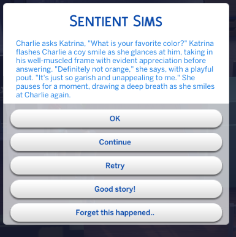

# Sentient Sims FAQ

## What is Sentient Sims?

Sentient Sims is a mod for The Sims 4 that brings AI-generated dialogue to your gameplay. It allows your Sims to engage in lifelike conversations, responding to their environment, relationships, and current moods.

## What are the features of Sentient Sims?

- AI-Generated Dialogue: Sentient Sims uses artificial intelligence to create immersive conversations between your Sims. They can discuss their day, share stories, gossip, argue, flirt, and more.
- Customizable Personality Descriptions: You have the power to shape your Sim's personality like never before. Whether you want to edit the existing personality descriptions of iconic Sims like Bella Goth to fit your vision or create entirely new descriptions, the choice is yours. Add that extra flavor and uniqueness to your Sims!
- Enhanced Gameplay Experience: Sentient Sims takes your Sims 4 gameplay to the next level by making interactions feel natural and spontaneous, with depth and realism.

## Which interactions are supported?

Currently only a subset of interactions will be Sentient. 

The main interactions supported are social interactions.

More are added each update!

## Where can I download Sentient Sims?

To download Sentient Sims, visit our website at [https://www.sentientsimulations.com/](https://www.sentientsimulations.com/). Login and follow the instructions provided on the How To Install page to install the mod and start enjoying AI-generated dialogue in The Sims 4.

## What is Open AI API and the API key used for?

Open AI is the service behind ChatGPT. The mod uses the Open AI API and uses the same model that runs ChatGPT (gpt-3.5-turbo).

You will need to create or have an account with OpenAI in order to use the mod.

Creating an API Key with Open AI allows the mod to use the API to generate just like ChatGPT but inside the Sims.

Your API key is a secret and is never sent to Sentient Sims and stays local to your computer.

## How can I get support or report issues?

If you need support or want to report an issue, visit the discord.

https://discord.com/invite/JTjbydmUAp

## Is Sentient Sims compatible with other mods?

Sentient Sims should be compatible with other mods, but I haven't yet tested this with any other mods.

## How do I make my interactions from my mod generate dialogue?

[See main README.md for contributing](https://github.com/guspuffygit/sentient-sims)

## What is the Sentient Sims Companion App?

The Sentient Sims Companion App runs in the background to keep your interactions with the OpenAI API secure. It makes sure that the communication between the mod and the OpenAI API is protected. 

The developers of Sims 4 didn't include the necessary tools for secure requests, so the Sentient Sims Companion App is needed to make it work securely. In short, the app makes sure your requests to Open AI are safe and private.

Think of them as a special lock that keeps your information safe while it travels between the mod and the API.
